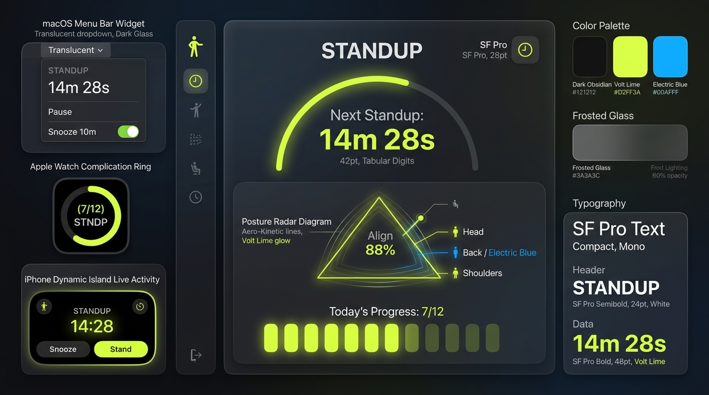
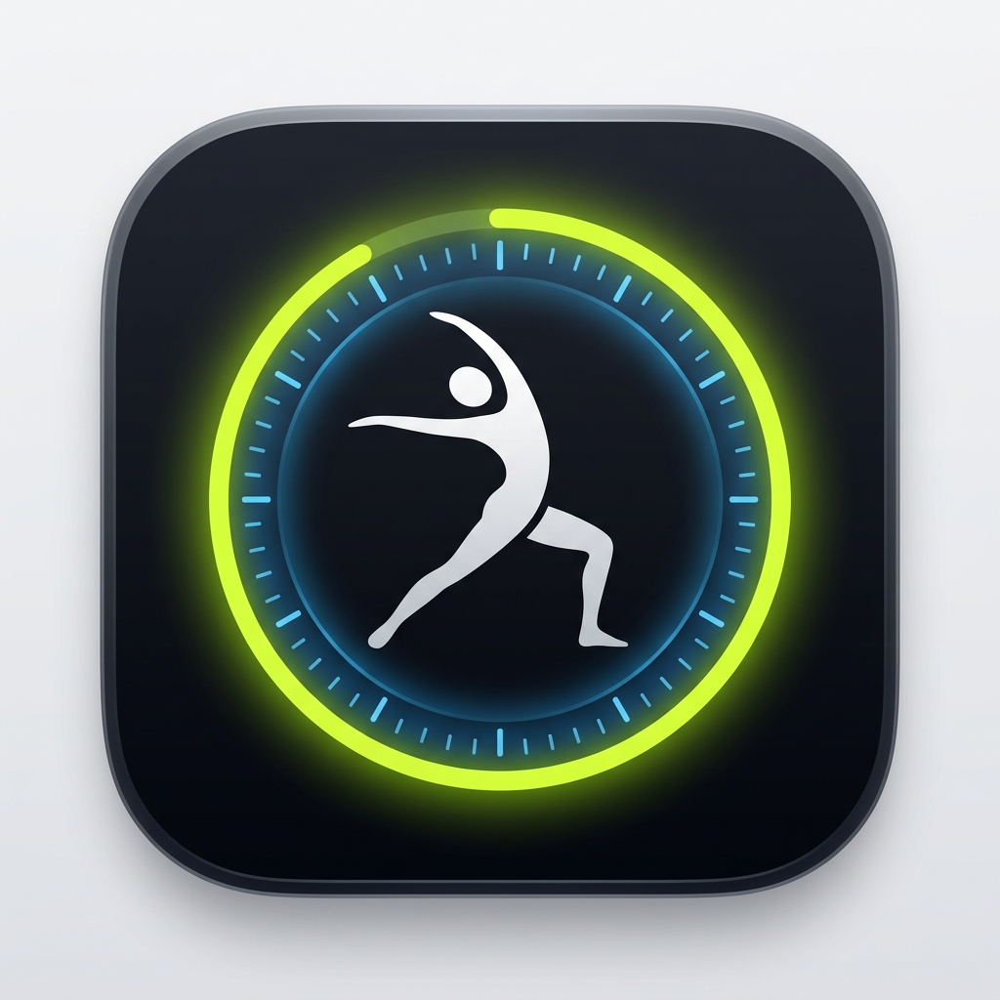
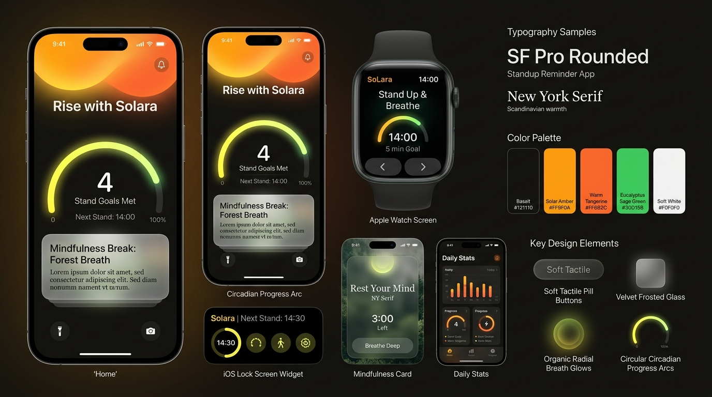
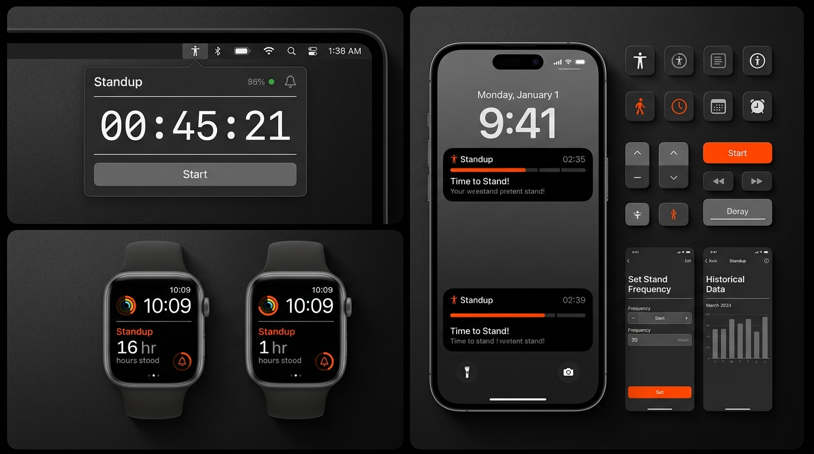

> **IMPLEMENTATION DIRECTIVE (2026-08-27, per Thomas):** This mood board is the chosen design direction for this app. Implementing it is **mandatory, not optional**. Follow its palette, typography, materials, and interaction model; adapt to platform constraints, but do not substitute the direction. Work is not done until the app's surfaces visibly reflect this document in a running build. Justify any divergence in the commit message.

**Winning direction (chosen by Thomas, 2026-08-27): Aero-Kinetic.**

# Stand Up Reminder · Aero-Kinetic Design System & Mood Boards

This document serves as the canonical design system specification and visual reference for **Stand Up Reminder**, grounding the product in **Apple Human Interface Principles** (clarity, deference, depth, fluidity) combined with **hyper-modern craft** (refined spatial materials, optical weighting, continuous motion, and high-legibility telemetry).

---

## The Winning Aesthetic Direction: Aero-Kinetic

> **Core Concept:** A high-performance ergonomic instrument. Blends VisionOS-style translucent refractive materials with razor-sharp telemetry cues and vibrant Kinetic Volt accents.

### 1. Visual Language & Materials
- **Surfaces:** Deep obsidian base (`#0A0B0E`) with multi-layered frosted translucent slate (`#161922` at 70% opacity, `.ultraThinMaterial`).
- **Edge Treatments:** `0.5pt` specular inner borders (`rgba(255, 255, 255, 0.14)`) simulating optical glass refraction and ambient rim lighting.
- **Micro-Depth:** Elevated floating cards with progressive shadow spread (`shadow(color: .black.opacity(0.35), radius: 24, y: 12)`).

### 2. Color System
| Role | Name | Hex / P3 Token | Purpose |
|---|---|---|---|
| **Base Surface** | Obsidian Void | `#0A0B0E` | Background floor across Mac popovers, settings, and iOS surfaces |
| **Elevated Glass** | Frosted Slate | `#161922` (70% opacity) | Dynamic Island, widget cards, menu bar popover plate, settings cards |
| **Primary Accent** | Kinetic Volt | `#D2FF3A` | Active countdown arc, stand confirmation, primary CTAs, active toggles |
| **Secondary Accent**| Ion Blue | `#0A84FF` | Posture alignment telemetry, sync indicators, secondary states |
| **Primary Text** | Titanium White | `#FFFFFF` | Headers, active countdown timers, primary labels |
| **Muted Text** | Vapor Gray | `rgba(255, 255, 255, 0.55)` | Micro-eyebrows, auxiliary metadata, timestamp labels |
| **Alert / Overdue** | Kinetic Orange | `#FF9F0A` | Urgent stand alerts, prolonged stillness warnings |

### 3. Typography & Micro-Hierarchy
- **Primary Timers:** `SF Pro Display`, Bold / Semibold, Tabular Figures (`.monospacedDigit()`), tight tracking (`-0.5pt`).
- **Telemetry & Readouts:** `SF Mono`, Medium / Bold, uppercase, letter-spacing `+0.8pt` (e.g., `STANDUP · 14M 28S`, `POSTURE RADAR · NOMINAL`).
- **Body & Prompts:** `SF Pro Text`, Regular, neutral line-height.

### 4. Experience across Apple Surfaces
- **macOS Menu Bar:** Translucent floating glass popover with an illuminated Volt progression arc around the stretching figure, authority badge, and posture radar.
- **macOS Settings:** Custom segmented top tab navigation bar with glowing Volt icons, dark obsidian canvas floor, and frosted glass section cards.
- **Dynamic Island & Live Activity:** High-contrast pill featuring the stretching figure glyph with live timer interval, expanding into interactive `Done Break` and `Snooze 10m` actions.
- **Apple Watch:** Full-screen circular countdown dial with glowing Volt arc and multi-tier haptic feedback patterns (`.success` on Done).
- **Acoustic Signature (`AeroAcoustics`):** Synthesized 528 Hz / 1056 Hz harmonic glass chimes with smooth exponential decay.

---

## Alternative Ideation Directions

### Direction 2: Biomorphic Sol (Circadian Warmth & Humanist Fluidity)
> **Concept:** An organic, circadian companion. Replaces jarring alarms with calming ambient lighting, breathing color shifts, and tactile warmth.

* **Palette:** Smoked Basalt (`#121110`), Solar Amber (`#FF9F0A`), Warm Tangerine (`#FF6B2C`), Eucalyptus Sage (`#30D158`), Soft Bone White (`#F5F3EF`).
* **Typography:** `SF Pro Rounded` + `New York` editorial serif.

---

### Direction 3: Studio Monolith (Pure Restraint & Hi-Fi Typographic Rigor)
> **Concept:** Industrial studio monitor utility. Inspired by Teenage Engineering, Dieter Rams, and Apple Pro Display aesthetics—zero superfluous decoration.

* **Palette:** Pitch Black (`#000000`), Anodized Charcoal (`#1C1C1E`), Safety Orange (`#FF4500`), Nominal Green (`#32D74B`), Pure White (`#FFFFFF`).
* **Typography:** `SF Pro Heavy` / strict tabular monospace.

---

## Direction Comparison Matrix

| Dimension | 1. Aero-Kinetic (Selected) | 2. Biomorphic Sol | 3. Studio Monolith |
|---|---|---|---|
| **Visual Tone** | Spatial, futuristic, high-performance | Warm, mindful, circadian, organic | Engineered, studio-grade, brutalist |
| **Apple Inspiration** | VisionOS + macOS Sequoia Glass | Apple Fitness+ + Health + Hermès | Apple Pro Display + Watch Ultra |
| **Accent Hue** | Kinetic Volt Lime (`#D2FF3A`) | Solar Amber (`#FF9F0A`) | Safety Orange (`#FF4500`) |
| **Typography** | SF Pro + SF Mono | SF Pro Rounded + New York Serif | SF Pro Heavy / Tabular Mono |
| **Sensory Vibe** | Precision instrument cockpit | Restorative wellness companion | Zero-nonsense studio tool |
| **Ideal For** | Tech power users, multi-screen setups | Health-focused & mindful desk workers | Minimalist developers & designers |

---

## Implementation Reference in Codebase

* **macOS Design System:** [`Sources/StandUpReminder/Theme/AeroKineticTheme.swift`](../../Sources/StandUpReminder/Theme/AeroKineticTheme.swift)
* **iOS Design System:** [`Sources/StandUpReminderiOS/AeroKineticTheme.swift`](../../Sources/StandUpReminderiOS/AeroKineticTheme.swift)
* **Spatial Acoustic Engine:** [`Sources/StandUpReminder/Engine/AeroAcoustics.swift`](../../Sources/StandUpReminder/Engine/AeroAcoustics.swift)
* **Global Hotkey Manager:** [`Sources/StandUpReminder/Engine/GlobalHotkey.swift`](../../Sources/StandUpReminder/Engine/GlobalHotkey.swift)
* **Menu Bar UI:** [`Sources/StandUpReminder/MenuBar/MenuBarView.swift`](../../Sources/StandUpReminder/MenuBar/MenuBarView.swift)
* **Settings Window:** [`Sources/StandUpReminder/Settings/SettingsView.swift`](../../Sources/StandUpReminder/Settings/SettingsView.swift)
* **Apple Watch App:** [`Sources/StandUpReminderWatch/StandUpReminderWatchApp.swift`](../../Sources/StandUpReminderWatch/StandUpReminderWatchApp.swift)
* **WidgetKit & Dynamic Island:** [`Sources/StandUpReminderWidget/StandUpReminderWidget.swift`](../../Sources/StandUpReminderWidget/StandUpReminderWidget.swift)
